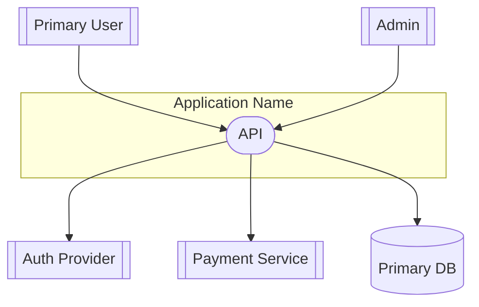
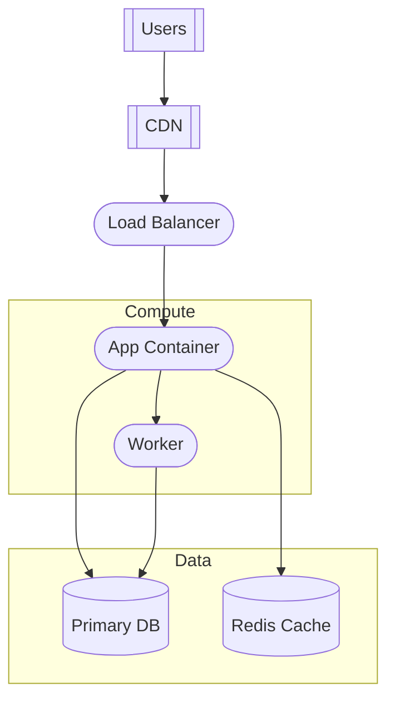
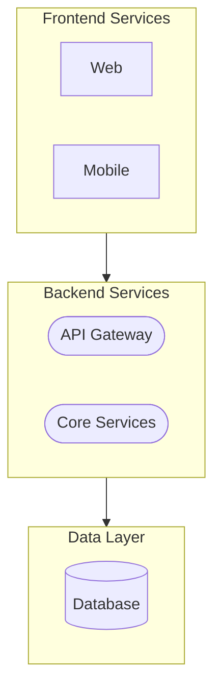
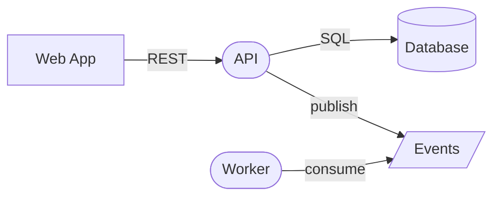

# Diagram Patterns

Strict patterns for generating consistent, readable diagrams in both ASCII and Mermaid formats.

## General Rules

1. **Maximum 12 nodes per diagram** - If more elements exist, group into logical clusters
2. **Use consistent node IDs** - Follow naming conventions below
3. **Left-to-right or top-to-bottom** - Choose one direction per diagram type
4. **No styling/colors** - Keep diagrams simple and portable
5. **Label all connections** - Use short, descriptive labels
6. **Always provide both formats** - ASCII for terminal/text, Mermaid for rendered views

---

## ASCII vs Mermaid Relationship

ASCII and Mermaid diagrams serve different purposes and intentionally differ in detail level:

| Aspect | ASCII Diagram | Mermaid Diagram |
|--------|---------------|-----------------|
| **Purpose** | High-level overview | Detailed interactions |
| **Audience** | Quick scanning, terminal views | Rendered documentation |
| **Scope** | Primary actors + core integrations (5-7 external systems max) | All identified integrations |
| **Detail** | Omit secondary/supporting systems | Include all external systems from research |

**Required annotation:** ASCII diagrams must include a comment line at the top:
```
(High-level context - see Mermaid diagram for detailed integrations)
```

**Grouping rule:** If the Mermaid diagram has >7 external systems, the ASCII diagram should:
1. Show the 5-7 most critical integrations individually
2. Group remaining systems with a label like `(+ N others)` or list them in a single box

---

## ASCII Diagram Patterns

### Context Diagram (ASCII)

```
                    +----------------+
                    |  Primary User  |
                    +-------+--------+
                            |
                            v
+-------------+     +-------+--------+     +-------------+
| Auth        |<--->|                |<--->| Payment     |
| Provider    |     |   Application  |     | Service     |
+-------------+     |                |     +-------------+
                    +-------+--------+
                            |
                            v
                    +-------+--------+
                    |   Database     |
                    +----------------+
```

**ASCII conventions:**
- Use `+---+` for boxes
- Use `|` and `-` for sides
- Use `<-->` for bidirectional, `-->` for directional
- Use `v` and `^` for vertical arrows
- Align boxes horizontally/vertically when possible

### Deployment Diagram (ASCII)

```
                         Internet
                            |
                    +-------v--------+
                    |      CDN       |
                    +-------+--------+
                            |
                    +-------v--------+
                    | Load Balancer  |
                    +-------+--------+
                            |
           +----------------+----------------+
           |                                 |
   +-------v--------+               +--------v-------+
   |  App Server 1  |               |  App Server 2  |
   +-------+--------+               +--------+-------+
           |                                 |
           +----------------+----------------+
                            |
           +----------------+----------------+
           |                                 |
   +-------v--------+               +--------v-------+
   |   Primary DB   |               |     Redis      |
   +----------------+               +----------------+
```

---

## Node Naming Conventions

| Component Type | Prefix | Example |
|----------------|--------|---------|
| User/Actor | `user_` | `user_admin`, `user_customer` |
| UI/Frontend | `ui_` | `ui_web`, `ui_mobile` |
| API/Service | `svc_` | `svc_api`, `svc_auth` |
| Database | `db_` | `db_postgres`, `db_redis` |
| Queue/Messaging | `queue_` | `queue_kafka`, `queue_sqs` |
| External System | `ext_` | `ext_stripe`, `ext_auth0` |
| Storage | `store_` | `store_s3`, `store_blob` |
| Container | `ctr_` | `ctr_app`, `ctr_worker` |
| Infrastructure | `infra_` | `infra_lb`, `infra_cdn` |

---

## Node Shapes

| Component Type | Shape | Syntax |
|----------------|-------|--------|
| User/Actor | Person | `user_x[["User"]]` |
| Service/API | Rounded rect | `svc_x([Service])` |
| Database | Cylinder | `db_x[(Database)]` |
| Queue | Parallelogram | `queue_x[/Queue/]` |
| External System | Double border | `ext_x[[External]]` |
| Storage | Stadium | `store_x([Storage])` |
| UI/Frontend | Rectangle | `ui_x[Web App]` |

---

## Context Diagram Pattern

Shows the system and its external interactions.

**Direction:** `flowchart TB` (top to bottom)

**Structure:**
1. System at center
2. Users/actors at top
3. External systems around edges
4. Databases/storage at bottom

**Template:**


**When to use subgraphs:**
- Group related services within the main system
- Show system boundary clearly
- Maximum 2 levels of nesting

---

## Deployment Diagram Pattern

Shows infrastructure and container topology.

**Direction:** `flowchart TB` (top to bottom)

**Structure:**
1. External access at top (users, CDN, load balancer)
2. Compute tier in middle
3. Data tier at bottom

**Template:**


**Environment variants:**
- If multiple environments exist, show production only unless specifically reviewing staging/dev

---

## Handling Complex Systems

When more than 12 nodes would be needed:

### Strategy 1: Group by Domain


### Strategy 2: Summarize Internals
Replace multiple similar components with a single representative node:
- "3 microservices" instead of showing each
- "Database cluster" instead of primary + replicas
- "Worker pool" instead of individual workers

---

## Connection Labels

Keep labels short (1-3 words):

| Interaction | Label |
|------------|-------|
| HTTP/REST | `REST` or `HTTP` |
| GraphQL | `GraphQL` |
| gRPC | `gRPC` |
| Database query | `SQL` or `query` |
| Message publish | `publish` |
| Message consume | `consume` |
| Authentication | `auth` |
| Read data | `read` |
| Write data | `write` |

**Example with labels:**


---

## Anti-Patterns to Avoid

1. **Too many nodes** - Diagram becomes unreadable
2. **Missing labels** - Connections unclear
3. **Inconsistent directions** - Confusing flow
4. **Deep nesting** - More than 2 subgraph levels
5. **Styling overload** - Colors, icons, custom CSS
6. **Invented components** - Only show what's evidenced in code
