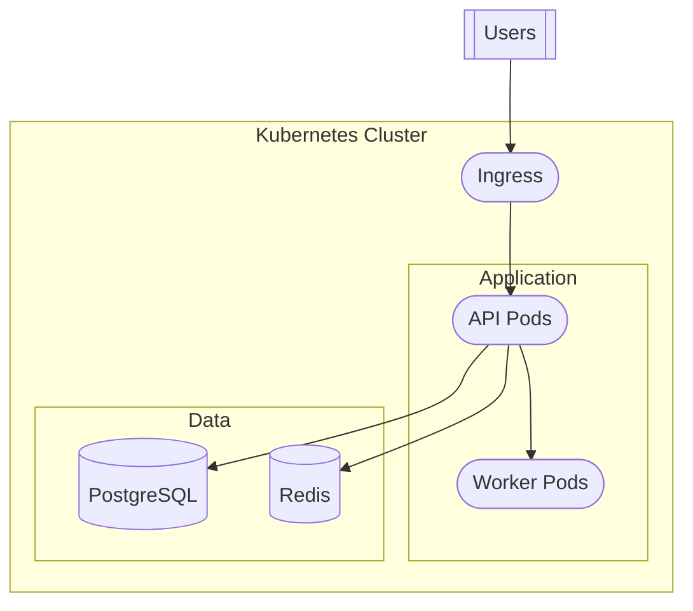
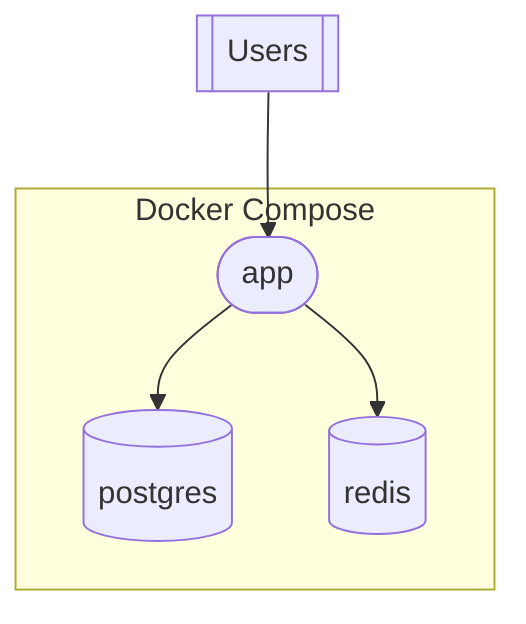

# Deployment View Specification

The Deployment View describes how the system is deployed, the infrastructure it runs on, and the CI/CD pipeline.

## Purpose

Answer: "How and where does this system run?"

## Required Elements

### 1. Deployment Description
2-3 sentences summarizing:
- Deployment model (containerized, serverless, VMs)
- Target environment (cloud, on-prem, hybrid)
- Deployment frequency indicators

**Example:**
> The application is containerized using Docker and deployed to Kubernetes on AWS EKS. Infrastructure is managed via Terraform. CI/CD is automated through GitHub Actions with deployments triggered on merge to main.

### 2. Infrastructure Diagram (MANDATORY)
Follow [mermaid-patterns.md](../mermaid-patterns.md) Deployment Diagram Pattern.

Include:
- Entry points (load balancer, CDN, API gateway)
- Compute resources (containers, pods, functions)
- Data stores (databases, caches, storage)
- Supporting services (queues, monitoring)

### 3. Environments Table

| Environment | Purpose | Configuration |
|-------------|---------|---------------|
| Development | Local development | docker-compose.yml |
| Staging | Pre-production testing | staging namespace, reduced replicas |
| Production | Live traffic | prod namespace, auto-scaling |

Document for each environment:
- How it's configured (which files/manifests)
- Key differences from production
- Access controls if evident

### 4. CI/CD Pipeline Description
Document the deployment pipeline:

**Pipeline Stages:**
1. **Build** - Compile, lint, type-check
2. **Test** - Unit tests, integration tests
3. **Package** - Docker build, push to registry
4. **Deploy Staging** - Automatic on PR merge
5. **Deploy Production** - Manual approval required

**Include:**
- CI/CD platform (GitHub Actions, GitLab CI, Jenkins)
- Trigger conditions (push, PR, tag)
- Artifact storage (container registry, package repo)
- Deployment strategy (rolling, blue-green, canary)

### 5. Container Configuration
If containerized, document:

**Dockerfile Analysis:**
```
Base Image: node:20-alpine
Multi-stage: Yes (builder + runtime)
Exposed Ports: 3000
Health Check: /health endpoint
User: Non-root (node)
```

**Docker Compose Services:**
- List services defined
- Dependencies between services
- Volumes and networks

### 6. Infrastructure as Code
If IaC is present:

**Terraform/Pulumi/CloudFormation:**
- Provider/cloud platform
- Key resources defined
- Module structure

## Data Sources (from research.json)

- `deployment.containerization` → Docker setup
- `deployment.orchestration` → Kubernetes/ECS config
- `deployment.cicd` → Pipeline configuration
- `deployment.infrastructure` → IaC details
- `configuration.configFiles` → Environment configs

## Diagram Generation Rules

For Kubernetes deployments:


For Docker Compose deployments:


## When Information is Missing

If no deployment config found:
> Deployment configuration not found in repository. The application may be deployed manually or deployment configuration is maintained separately.

If partial information:
> Not applicable - no evidence found for [specific element]

Common missing elements:
- IaC not present → "Infrastructure managed outside repository or manually provisioned"
- No CI/CD config → "CI/CD pipeline not configured in repository"
- No containerization → "Application appears to run directly on host OS"
